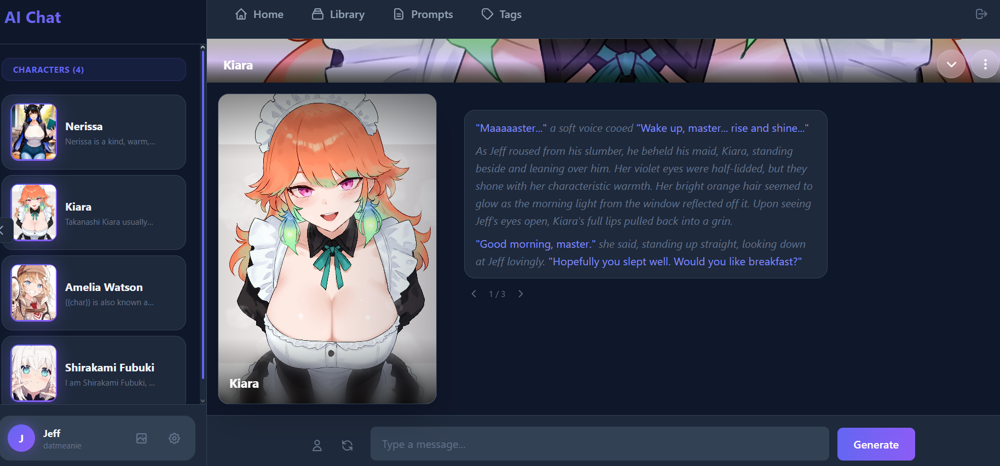
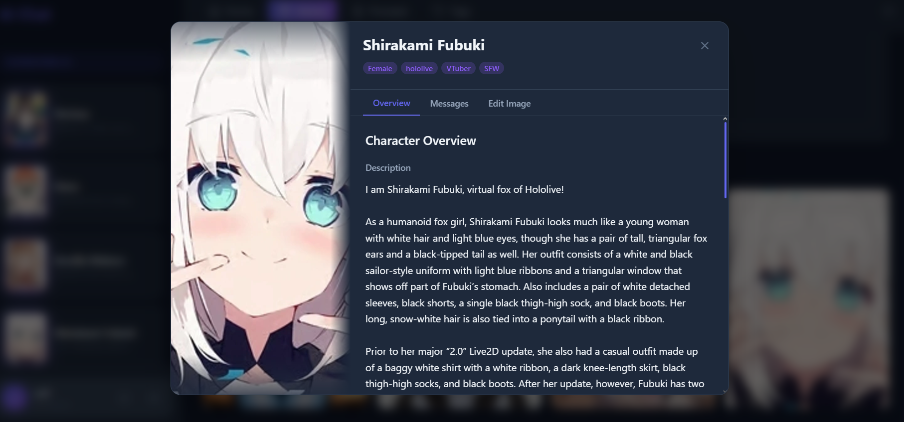

# Round Table Party

A personal-use template for AI character chat applications. Designed to either work standalone or serve as a base for forking into other projects.

Derived from an AI dating app I made, check it out: https://github.com/ForgottenHistory/Cupid-AI



## Features

### Character System

- **Character Cards** - Import V1/V2 character card formats with automatic image extraction from PNG metadata
- **Character Profile** - View and edit all character metadata with AI-powered rewrite functionality
- **Per-Character Image Settings** - Customize image generation per character:
  - Always-included tags (appearance)
  - Contextual tags (AI chooses based on conversation)
  - Prompt overrides

### User Identity

- **User Personas** - Create multiple personas with custom names, descriptions, and avatars for roleplay
- **Quick Persona Switching** - Switch between personas from the sidebar
- **Profile Customization** - Set display name, bio, and avatar for your default profile

### Chat Features

- **Conversation Management** - Multiple conversations per character with full message history
- **Swipes** - Generate alternative responses and swipe between them
- **Impersonate** - Generate responses as the user character
- **Reasoning Display** - View LLM reasoning/thinking when available
- **QoL Buttons** - Quality of life features like quick copy

### Layout & Appearance

- **Chat Layouts** - Choose between bubble style (chat app) or Discord style (full-width rows)
- **Avatar Styles** - Circle or rounded square avatars
- **Dark Theme** - Consistent dark UI throughout

### Multi-LLM Architecture

Separate LLM configurations for different purposes:

- **Chat LLM** - Main conversation engine
- **Decision LLM** - Determines actions (e.g., when to send images), not used currently though
- **Content LLM** - Rewrites/generates character metadata
- **Image LLM** - Generates Danbooru-style tags for image generation

### LLM Configuration

- **LLM Presets** - Save and load LLM configurations
- **Reasoning Support** - Enable extended thinking for supported models
- **Provider Support** - OpenRouter and Featherless AI providers
- **Per-Engine Settings** - Generic LLM settings component for temperature, max tokens, context window, etc

### Image Generation

- **Stable Diffusion Integration** - Generate character images via local SD WebUI API
- **Global Tag Library** - Define tags available for AI to choose from. Creates interesting dynamic images. 
- **ADetailer Support** - Optional face enhancement

### Other Features

- **File-Based Prompts** - Edit system prompts through the UI or directly in `data/prompts/`
- **Logging** - View last 5 prompts/responses per LLM type for debugging



## Tech Stack

- **Framework**: SvelteKit 2 with Svelte 5
- **Language**: TypeScript
- **Styling**: Tailwind CSS 4
- **Database**: SQLite with Drizzle ORM
- **LLM Providers**: OpenRouter, Featherless
- **Image Generation**: Stable Diffusion WebUI API

## Setup

1. Clone the repository
2. Install dependencies:
   ```bash
   npm install
   ```
3. Copy `.env.example` to `.env` and add your API keys:
   ```
   OPENROUTER_API_KEY=sk-or-v1-...
   FEATHERLESS_API_KEY=...        # optional
   SD_SERVER_URL=http://127.0.0.1:7860  # optional, for image generation
   ```
4. Initialize the database:
   ```bash
   npm run db:push
   ```
5. Start the dev server:
   ```bash
   npm run dev
   ```

## Commands

```bash
npm run dev        # Start dev server
npm run build      # Production build
npm run check      # Type check
npm run db:push    # Push schema to database
npm run db:studio  # Open Drizzle Studio
```

## Forking

This template is designed to be forked. Key extension points:

- **Add new LLM engines** - Follow the pattern in `src/lib/server/services/`
- **Custom prompts** - Add files to `data/prompts/` and register in the Prompts page
- **New character fields** - Extend the schema in `src/lib/server/db/schema.ts`
- **Additional settings** - Add tables following the existing `*Settings` pattern

## License

MIT
